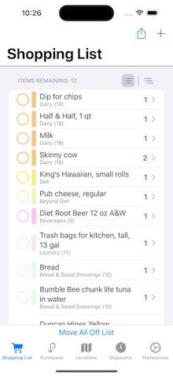
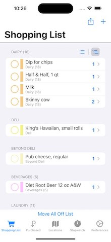
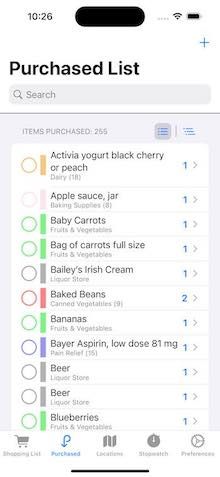
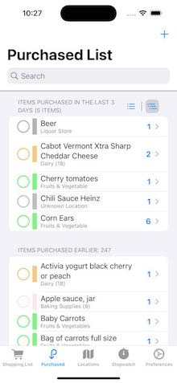
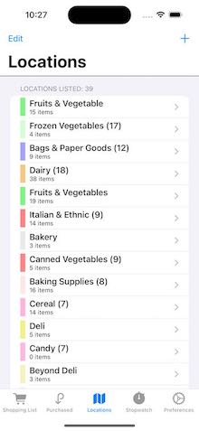

#  About "ShoppingList16"

ShoppingList16 is a simple iOS app to process a shopping list that you can take to the grocery store with you, moving items off the list as you pick them up.  It persists data in Core Data (optionally, synched across your personal devices using iCloud if you configure the app correctly) written entirely with Swift and SwiftUI.  This project was posted using Xcode 14.2 and requires iOS 16.2 or later.

* in ShoppingList16, i will be using iOS16-specific features more often. Please see the section "What's New in ShoppingList16" to see which ones are now being used (as of the initial release), as well as some things that have changed in both the UI and at the code level. 

This is the fourth iteration of my original ShoppingList project and will one more time be my learning environment for new features in what most people call "SwiftUI 4," the version of SwiftUI released at WWDC in June, 2022.  I will try to use newer features available in iOS 16 whenever I can.

* An [earlier version of this project](https://github.com/delawaremathguy/ShoppingList15) is available that works with XCode 13.5/iOS 15.  If you have not yet made the move to XCode 14/iOS 16, you should use this earlier project instead.  

  - Of note: ShoppingList15 has three branches: the branch most similar to the code of this project is in the `master` branch; the branch `MVVM` has a more clearly-defined MVVM architecture that does not use `@FetchRequest`; and the `MVVM-2` branch is built on top of `MVVM` with a significant twist.

* An [even earlier version of this project](https://github.com/delawaremathguy/ShoppingList14) is available that works with XCode 12.5/iOS 14.5.

* And [the original version of this project](https://github.com/delawaremathguy/ShoppingList) is available that was posted with XCode 11.7/iOS 13.7. 

Feel free to use this as is, to develop further, to completely ignore, or even just to inspect and then send me a note or Open an Issue to tell me I am doing this all wrong.  

## Latest Release: 25 July, 2023

* (*25Jul*) an Archive feature (Export/Import) is now available so that you can export all ShoppingList data to a file through the Files App, and import ShoppingList data from the Files App.  this will be useful if 

  - you only run the app locally, so you can keep a backup of data (if you're on the cloud, the cloud is your backup)
  - you want to share your data with someone else
  
	this is achieved by using .fileImporter and .fileExporter (which are iOS 14 features).
	
	
* (*25Jul*) there is a UI change: the Stopwatch tab for an in-store timer has been renamed as a "More..." tab and been moved to the last tab position.  this screen now contains the timer, options to save/restore (export/import) data through the Files app, and (when on the simulator) an option to load sample data so you can test out the app.

* (*25Jul*) all of the somewhat unstructured "development" code to load sample data and write JSON that's been hiding in plain sight since the original SL project has been removed.  (it can now be done using the archive facility.)

See the ChangeLog below for other changes in this release of ShoppingList16.

## General App Structure

The main screen is a TabView (in portrait orientation) or Split View (in landscape orientation on an iPad) that presents:

   

* a (searchable) list of previously purchased items, displayed either in one section, or in two sections with the first showing items "purchased today/recently" and a second showing all other items.

   

* a list of "locations" in a store, such as "Dairy," "Fruits & Vegetables," "Deli," and so forth

 

* a user Preferences tab, which also contains 

* a "More..." tab that contains an in-store timer to track how long it takes you to complete shopping (not shown), buttons to export or import shopping list archives, and (for development purposes only) a button so you can load sample data so you can try out the app.

For the first two tabs, tapping on the circular button on the leading edge of an item's display moves a shopping item from one list to the other list (from "on the shopping list" to "purchased" and vice-versa).  

Tapping on any item (*not the leading circular button*) in either list lets you edit it for name, quantity, assign/edit the store location in which it is found, or even delete the item.  Long pressing on an item gives you a contextMenu to let you move items between lists or toggle between the item being available and not available.  (*Items not available will have a strike-through, italic presentation on screen*.)

The shopping list is sorted by the order of the locations specified in the `LocationsView`, and then alphabetically within each location.  Items in the shopping list cannot be otherwise re-ordered, although all items in the same Location have the same user-assignable color as a form of grouping.  

The shopping list has a "share" icon in the navigation bar that will bring up a share sheet, so that you can send off a copy of your list by email, text, or social media.

The shopping list and the purchased item list have buttons in the header of the first section to toggle the display from a simple, one-section list, to a multi-section list.  For the shopping list, a multi-section display is broken out by Location; for the purchased item list, a multi-section display is broken out by items purchased "today/recently" and then by those purchased earlier.

The third tab shows a list of all locations, where you can create, edit, reorder (by dragging after tapping the Edit button), and delete `Location`s.  One special Location is the "Unknown Location," which serves as the default location for all new or orphaned items.  I use this special location to mean that "I don't really know where this item is yet, but I'll figure it out at the store." The unknown location always appears last in the list of Locations, and shopping items with this unknown location will come at the bottom of the shopping list. 

Tapping on a Location in the list lets you edit location information, including changing its color, or even deleting it.  the color is settable using the ColorPicker available since iOS 14.  You will also see a list of the Items that are associated with this Location, with those currently on the shopping list indicated by "cart" symbols.  (new) a long-press on an item lets you quickly toggle whether the item is on the shopping list of not.

* What happens to Items at a Location when the Location is deleted?  The Items are not deleted, but are moved to the Unknown Location.

The fourth tab is a Preferences tab that contains:

* a stepper to change the user default value for the number of days used to section out the PurchasedTabView;
* a toggle to control whether a running stopwatch/timer should be suspended when the app is in the background.

The final tab titled "More..." contains 

* an in-store timer, with three simple button controls: "Start," "Stop," and "Reset."  This timer does *not* pause when the app goes into the background -- e.g., if you pull up a calculator or take a phone call while shopping. (*you can change this behaviour in Preferences*.)
* two button to allow to to export or import archived ShoppingList data through the Files app.

Here's what you do next:

* **If you would like to test out this app and decide if it might be of interest to you**, run it on the simulator, go straight to the More... tab on startup and tap the "Load Sample Data" button.  Now you can play with the app.

* **If you plan to install and use this app on a single device**, the app will start with an empty shopping list and a location list having only the special "Unknown Location"; from there you can create your own shopping items and locations associated with those items.  (*Suggestion: add Locations before adding Items!*) 

* **If you plan to install and use this app on a device and have it share its data via iCloud with other devices on the same Apple ID**, see advice in previous paragraph; but also go to the PersistentStore.swift file and choose to use `NSPersistentCloudKitContainer`, and follow instructions there about setting up your own CloudKit container.

## What's New in ShoppingList16

iOS 16-specific, code-level changes from the previous release of SL15 project that you will find in this release include:

* `NavigationView` has been replaced by `NavigationStack` and i have used the `.navigationDestination` syntax to support navigation links in *most* cases.
* use of the iOS-native `ShareLink` now replaces Shaps Benkau's `ActivityView` package.
* the deprecated `Alert()` struct and `.alert(item:)` view modifier have been replaced with usage of either `.alert(isPresented:)` or `.confirmationDialog(::)` syntax.  (also removed in this version is a more general mechanism to present alerts i introduced in SL15 that was based on the `.alert(item:)` modifier.)
* a `NavigationSplitView` is now used in place of the main-level `TabView` in regular environments on an iPad, so the app will look and feel a little better on an iPad.

Other code-level and UI changes of interest include:

* `Item` and `Location` now have `color` properties that are real SwiftUI Colors, replacing earlier use of UIKit's `UIColor`.
* the `visitationOrder` of Locations is no longer user-settable of even user-visible.  the ordering of Locations is accomplished by dragging rows within the `LocationsView` to change the order of Locations.
* i have removed some fancy or clever (or perhaps some would say quirky) code sequences of SL15 in favor of using a back-to-basics approach.  example: there are no IdentifiableSheets or IdentifiableAlerts.
* the `ShoppingListView` is now based primarily on a `@FetchRequest` for `Locations`s and not `Items`.  this solves a problem never addressed in SL15, SL14, and the original SL: reordering locations in the LocationsView would not cause the ShoppingListView to be updated (and it must be, since the view is based on the order of locations).

    -- and as a bonus: the sectioning code in `ShoppingListView` is now more direct.

* there is no longer a global, singleton object referencing the PersistentStore.  rather, it is created when the App begins and is injected into the SwiftUI environment.  further, each of the `Item` and `Location` classes now have a static variable to locate the PersistentStore directly, and these values must be set once the PersistentStore is created.
* the Preferences tab has been cleaned up (both visually and in code) and one new preference has been added (whether or not to suspend a running, in-store timer when the app goes into the background ... e.g., if you get a phone call, should the timer keep running).
* the list of items displayed for a given Location when looking at the location's detail now indicates whether an item is on the shopping list.  (i find that it's easier to put together a shopping list from the Location screens that to do a search on the Purchased items screen.)  a context menu is available for each item to allow you to quickly change the item's on-list status.

### Core Data Notes

The Core Data model has not changed since [ShoppingList14](https://github.com/delawaremathguy/ShoppingList14). 

### App Architecture

The design in this app reverts to a basic, @FetchRequest-driven SwiftUI app structure, with only a few hints of MVVM scattered about.   in particular, the `Item` and `Location` classes have static methods to support adding and deleting objects, as well as a (static) reference to the `PersistentStore`, and thus collectively take on somewhat of either a "VM" or just an "M" role in the app.

But there are always several concerns when working with Core Data in a SwiftUI app:

* SwiftUI is designed to work best with read-only (struct) data, as a View should never really  care exactly where the data comes from or if/how it is persisted.  

Unfortunately, when a View accesses its data using `@FetchRequest`, it is being given (class) objects that are known to be living in a specific Core Data context; for which many of the object's properties are optional and may need conversion (e.g., `Int32` to `Int`) or nil-coalescing; and whose objects are directly writeable by the view.  The View may also have to know about some syntax involving Core Data key paths or `NSManagedObjectContext`s.

Thus, some notions to which i have tried to adhere in this updated SL16 are:

* except for the explicit appearance of `@FetchRequest`, no View "really" knows that its data come from Core Data (*there are no direct use of Core Data keypaths or managedObjectContexts by a View, and all attributes of Core Data entities have been massaged through computed properties to avoid nil-coalescing, or Int to Int32 conversions*);

* no View should ever access or manipulate attributes of a CD entity directly (yeah, they can still do that if they want, but a reasonably-sensible attribute and naming convention should alert you as to when you are intentionally going directly into Core Data); and

* the associated "View.swift" file that defines a View never has to include the line `import CoreData`.

The code of this app **is faithful to these three notions**, and I *still* think the result works quite well for such a small app.  

## License

* The app icon was created by Wes Breazell from [the Noun Project](https://thenounproject.com). 
* The extension I use on Bundle to load JSON files is due to Paul Hudson (@twostraws, [hackingwithswift.com](https://hackingwithswift.com)) 
* a view modifier named `navigationAppearance()` comes straight from YouTube content provider [Stewart Lynch](https://createchsol.com) and i hope you'll consider subscribing to his YouTube channel and possibly even "buying him a Ko-Fi".

Otherwise, just about all of the code is original or widely available, and it's yours if you want it -- please see LICENSE for the usual details and disclaimers.

## ChangeLog (beginning 2 March, 2023)

* (*16Mar*) the `.xcodeproj` project file(s) have now been added to the repo.  apologies for not catching this.

